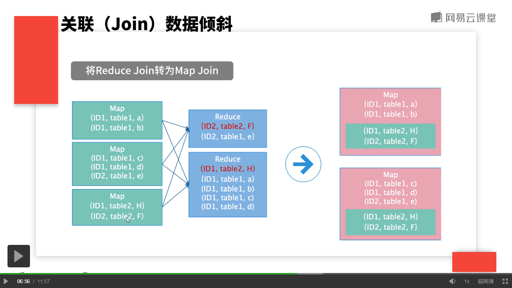
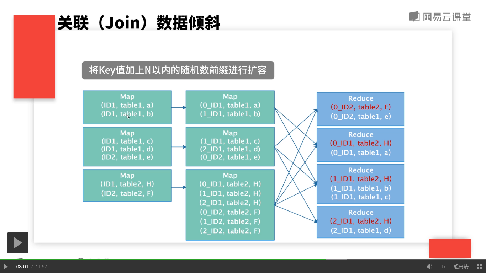

## 数据倾斜
什么是数据倾斜？  

	数据在集群上处理时，会被分配到各个节点。当数据分配不均时，个别节点的数据量特别多。会导致整个任务变慢，甚至出现内存溢出程序失败的情况。

数据倾斜会什么时候发生？  

	MR处理数据时，会按照Key值将数据分配在不同的节点上面，当分配算法不均匀的时候，或者说某一个或几个Key值比较多的时候，就会发现大量的数据被分配到少数的几个节点上面，这样就会造成数据倾斜。  

怎么发现数据倾斜？

	一个显著的标志就是每一个map都运行完了，而reduce卡在了99.在数据处理上，不怕数据量大，就怕数据倾斜。因为如果数据量大可以分配到多台机器上，如果这些机器不足以处理这些数据，可以线性的拓张机器，但是一旦发现了数据倾斜，就会存在大量的数据分配到少数的节点上去，这样的话程序会很难运行完成的。

## Map端倾斜

Map端数据倾斜比较少见，因为Map端每个节点处理的数据量由InputFormat决定。而对于大多数情况而言，我们的数据是从HDFS上读取出来的，对于文件的输入MapReduce框架提供了FileInputFormat的这样一个类，将文件按照块均等的划分为不同的分片，因此这一块的处理逻辑不需要去实现。对于一些自定义的数据源，我们需要自定义InputFormat，这时候就需要在getSplits()方法中间自己编写算法将数据均匀分片。

## Reduce端数据倾斜
几种常见的倾斜：

	* Map端输出的某几个Key的数据量特别大
		* 在实际业务中，会碰到数据中有些空值，当这些空值作为key值时，会出现数据倾斜，可以根据业务需求这些空值是否可以过滤掉。这时最简单最常见也是最有效的方法。
		* 对于Reduce端要聚合成一个值的运算（比如累加），可以先在Map端设置Combine操作，提前将数据聚合。（局限性：聚合操作必须将多个值聚合成一个或少量的值，比如书累加操作）
		* 自定义Partitioner类，编写特定的getpartition 函数将数据量大的key值分片均匀。（一般用的少，局限性大，会将同一个key值分配到不同reduce中，如果这种情况不影响任务的最终运行，那么这种方法也是实际有效的）
	* 关联（Join）数据倾斜
		* 将reduce join转化为Map join（局限：必须是一个小表与大表做关联计算）
  
		
		* 将Key值加上N以内的随机数前缀进行扩容

