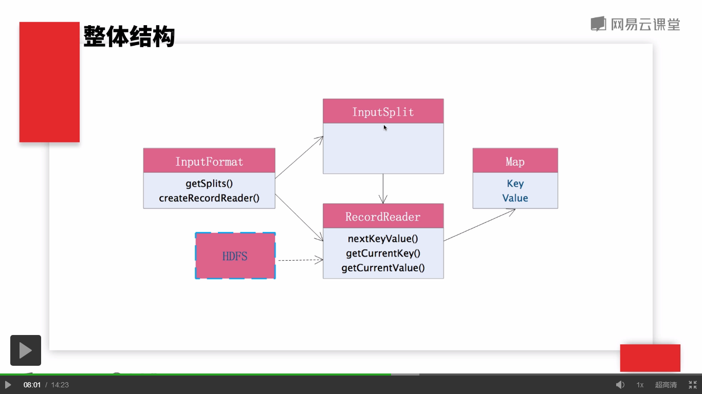

## MR程序的输入

	* Java程序如何读取文件数据？
		* FileInputStream将文件以流的形式读出来
	* Map中的Key/Value从何而来？
		* InputFormat生成，默认是TextInputFormat
		* 使用HDFS的FSDataInputSream读文件
		* 操作FSDataInputStream流的就是InputFormat，在MR框架中，FileInputFormat是一个超类，如果不指  
		  定类，将使用默认的TextInputFormat。
		* 在FileInputFormat中，MR程序会读取HDFS上的文件，而TextInputFormat是指将文件以文本的形式读取出来。

## InputFormat

	源码：
		public abstract class InputFormat<K, V> {
		    public InputFormat() {
		    }
			//抽象方法，将数据进行分片，把结果放到List<InputSplit>
		    public abstract List<InputSplit> getSplits(JobContext var1) throws IOException,   
            InterruptedException;
			//返回RecordReader<K, V>对象，这个对象会把一个分片中的数据读取出来，并写出Key/Value的形式，交给Map函数使用。
		    public abstract RecordReader<K, V> createRecordReader  
            (InputSplit var1, TaskAttemptContext var2) throws IOException, InterruptedException;
		}

	注意：
		* getSplits()方法获取所有分片，每一个分片对应一个map
		* createRecordReader()方法获取RecordReader对象，该对象负责读取一个分片的数据，并生成  
		  Key/Value给Map函数。
		* getSplits()在客户端运行，createRecordReader()在各个执行节点运行。getSplits()将数据进行  
		  分片，把分片的位置信息放到List<InputSplit>，而不存放数据。

## InputSplit

	代码：
		public interface InputSplit extends Writable {
		    long getLength() throws IOException;
		
		    String[] getLocations() throws IOException;
		}
	
	注意：
		* Split中不包含具体数据，而是指向数据的引用。
		* getLength()返回该数据分片的数据量。供MR分片之间的排序，优先处理大的数据分片。
		* getLocations()返回数据的存储位置，即一组主机名。根据这两个方法提供的信息，MR程序就可以在数据  
		  量大的机器上面本地启动Map程序，这样就保证数据尽可量少的在网络上传输。对应HDFS上的文件来说，这    
          两个方法MR框架已经编写好了，并不需要我们去编写。
		* 什么时候可能用到InputSplit这个类？在自定义的数据源中，不用刻意实现这两个方法，但是在Split   
		  必须存好这块数据的分片信息，然后再createRecordReader里根据分片信息读取相应的数据。

## RecordReader

	* Map运行时，会先调用nextKeyValue()方法，生成一个Key/Value键值对，然后调用getCurrentKey()和  
	  getCurrentValue()获取相应的值。这时获取的CurrentKey和CurrentValue都是从RecordReader中获取到的。

	源码：
		public abstract class RecordReader<KEYIN, VALUEIN> implements Closeable {
		    public RecordReader() {
		    }
			//初始化，在这里可以把文件打开或者把数据块连上
		    public abstract void initialize(InputSplit var1, TaskAttemptContext var2) throws IOException, InterruptedException;
			//获取下一条数据
		    public abstract boolean nextKeyValue() throws IOException, InterruptedException;
			//
		    public abstract KEYIN getCurrentKey() throws IOException, InterruptedException;
		
		    public abstract VALUEIN getCurrentValue() throws IOException, InterruptedException;
			//获取整个进度的
		    public abstract float getProgress() throws IOException, InterruptedException;
			//关闭资源
		    public abstract void close() throws IOException;
		}

## FileInput如何分片
	* 如果文件都比较小，则一个文件对应一个分片
	* 如果存在大文件，则分片通常与HDFS的快大小一样

	改变分片规则：
		分片计算公式：
			max(minimumSize,min(maximumSize,blockSize))

			其中
				minimumSize = mapreduce.input.fileinputformat.split.maxsize
				maximumSize = mapreduce.input.fileinputformat.split.minsize

		注意：minimumSize不要超过快大小！会将一个或多个快中的数据分配到一个map上取，会产生大量的网络开销，牺牲MR数据本地性。

## 小文件与CombineFileInputFormat

	* 一个文件对应一个map，如果有大量的小文件，会产生大量的map，但是每个map的计算量很小，严重浪费集群资源。
	* CombineFileInputFormat将小文件合并到一个map中，避免资源浪费。在编写代码是只需要在job中  
	  setInputFormat这个类进去，就可以将小文件合并到一个map中了。

## 整体架构图

