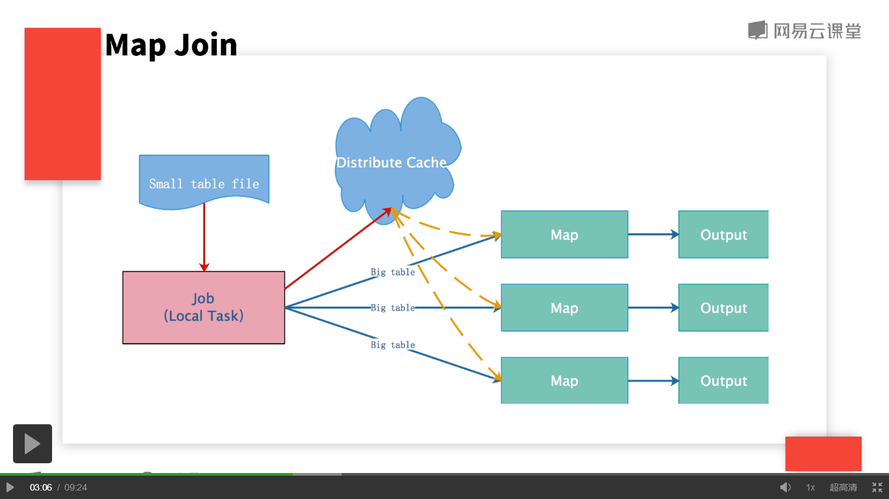
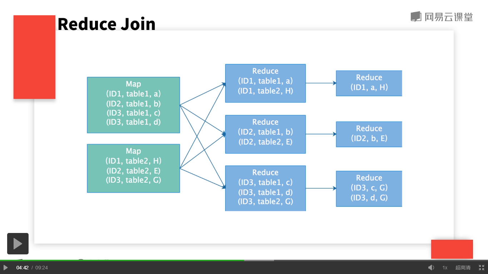
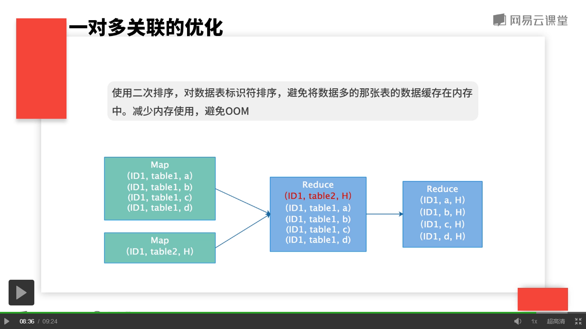

## 关联操作
就是SQL中join操作。

## 需求案例
	订单表与商品表关联，形成订单详情。

	如何关联？、
		将商品表存为HashMap，以商品的ID作为key值，以商品的名称作为value值。然后再订单表中，每扫描到一个商品ID，就去HashMap中找到对应的名称，将商品名称拼接到这条数据中。但订单量大时，需要将订单的数据分配到各个map中去，但是，不知道每一个map任务被分配了哪一些被购买的商品，所有说每一个map任务中，都必须存放一个全量的商品表。这就是Map join操作。
## Map Join
	过程：
		* 将关联中的一个文件（小文件）放大分布式缓存，将关联的ID作为Key值存为HashMap。
		* 将关联的另外一个文件（大文件）划分到各个Map，每个Map里访问分布式缓存，根据关联ID获取相应的数据。

	过程图：
  
	
	说明：
		MR程序在启动时，可以将HDFS上的小文件放在分布式缓存中（Distribute Cache），大文件会被分成一个个的数据分片，由几个Map任务进行处理。每一个Map都会去访问分布式缓存中小文件的数据，然后在map中将两个表关联起来，最后直接输出结果。当两个关联的文件都比较大时，这种方法就会导致内存溢出。
	
## Reduce Join
	能不能根据MR的特性将两个表的相同的需要关联的key值分配到同一个节点上面进行关联呢？
		将两个关联的文件都划分到各个Map中，并对每一条数据打上属于哪个关联文件的标记。然后再Map端将关联的ID作为输出的key值传给Reduce端。这样两张表中，相同的key值就会分配到同一个reduce端，然后在reduce端根据已经在Map中打上的不同数据表的标记，将两张表中的数据关联起来。

	过程图：

	说明:两张表，table1，table2.经过shuffle过程后，将相同的两张表相同的ID被分配到同一个Reduce中。然后在每一Reduce上将其关联起来。在关联的过程中，同样要将一张表缓存起来，然后扫描另外一张表的数据，将数据一条条关联起来。但是在Reduce中缓存的数据，都是每一张表的一部分数据，并不是全量数据，因此数据量不会很大，一般不会发生内存溢出的危险。

## Reduce端一对多关联的优化

	使用二次排序，将数据表标识符排序，避免将数据多的那张表的数据缓存在内存中。减少内存使用，避免OOM。

	问题：多对多的关联进行二次排序，能不能得到优化？

## 总结
	* Map Join ：适用于小表关联大表。运行效率高。不需要经过Reduce。
	* Reduce Join：通用关联方法，运行慢，可能发生数据倾斜。

