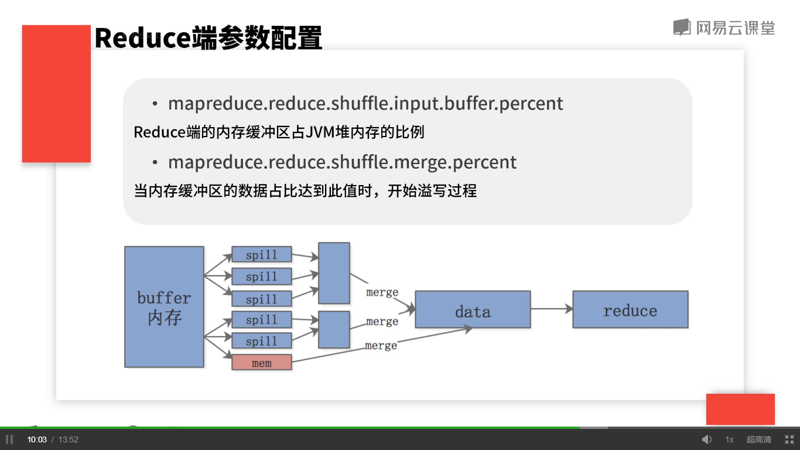

## 总体原则
	充分且合理利用机器资源，结合MapReduce运行原理，将数据分而治之。

	MR程序性能不佳，两个原因：
		* 没有充分利用集群资源，也就是集群资源浪费。
		* 没有利用好MR本身的特性。

## MR内存配置
如何充分利用集群资源？

	集群的资源主要分为：CPU以及内核的核数。每一个Map或Reduce任务都是单线程的任务，因此每一个Task都只会用到一个cpu核，对于每一个集群的租用方，都会给他分配一个单独的队列，这个队列包含着一定大小的内存和一定数量的CPU核数。我们将 总内存数/总核数 就大致得到每一个Map或者是Reduce任务分配的内存空间。  
	这样的好处可以充分的利用内存和CPU，不会出现CPU用完了，内存还有剩余的情况。或者内存用完了，CPU还有的情况。这只是默认的分配情况，对于一个具体的MR程序单独的分配CUP和内存。我们知道在yarn集群上面，每一个单独的任务都是在Container上运行的，我们可以设置：
		mapreduce.(map/reduce)reduce.memory.mb
			一个Container的内存上限。
		一个Container中运行的Java程序，由
			mapreduce.(map)reduce.java.opts
		设置Container中的JVM的最大堆内存数，一般设置成Container大小的70%——80%左右，通常来说一个任务分配的内存越多，运行的越快。

	* mapreduce.(map).reduce.memory.mb
	当一个Map或Reduce使用的内存超过该值，NodeManager会kill掉这个Container。此时要调大此值。
	* mapreduce.(map)reduce.java.opts
	当Java程序使用的堆内存超出此值，会抛出Out of Memory异常，此时调大此值。

	注意：mapreduce.(map)reduce.java.opts一定小于mapreduce.(map).reduce.memory.mb，因为Java程序在一个Container里运行。

## MR个数配置
	* mapreduce.job.maps
		对于输入为HDFS的文件来说，Map的给舒由InputFormat决定。但我们的数据不是来源于HDFS上的文件，而是自定义的数据，那么这个参数有可能生效。
	* mapreduce.job.reduces
		设置reduce的个数，适当的调大reduce个数有助于作业的高效运行，但是有些问题比如TopN问题只能设置一个Reduce。对于不需要的Reduce的任务，可以将该值设置为0.

	注意：map和reduce的个数并不是越大越好，每一个map和reduce在启动或初始化的时候都会消耗一定的时间。如果一个任务使用了大量的reduce和map，会占用集群上大量资源，会导致其他任务运行慢。

## Map端参数配置
MapReduce最复杂的shuffle参数调优

	map的输出数据会首先放到一个环形缓冲区中，这个环形缓冲区是放到内存里面的。通过:
		mapreduce.task.io.sort.mb
	来设置环形缓冲区的大小，默认是100M。调大可以减少溢写文件的数量，这样可以减少合并排序的次数，但是会占用更多的Map任务内存。
	
		* mapreduce.map.sort.spill.percent
	当Map输出到内存缓冲区中的数据占缓冲区大小的比例达到此值是，开始溢写。溢写开始的同时，环形缓冲区另外的空间任然有数据放进来。如果环形缓冲区被占满了，整个任务都会被阻塞。

## Map输出压缩
Map端我们输出的文件可以进行适量的压缩，这样可以减少从map端拷贝到reduce端的数据量，当我们的程序IO成为瓶颈的时候，我们会将：

	* mapreduce.map.output.compress 
	
设置为true。但会消耗CPU。

所有需要压缩与解压比较快的算法：

	* mapreduce.map.output.compress.codec
	
设置压缩类，一般为Snappy或者Lz4这种压缩和解压比较快的算法。

## Reduce端的参数调优
过程图：  
  

	* mapreduce.reduce.shuffle.input.buffer.percent
		Reduce端的内存缓冲区占JVM堆内存的比例。
	* mapreduce.reduce.shuffle.marge.percent
		当内存缓冲区的数据占比达到此值时，开始溢写过程。

当这个两个值设置的比较大的时候，数据会尽可能的放在内存之中，这样溢写的文件也会变大，就减少了合并排序的过程，从而加速整个程序的运行过程。

合并排序是一轮一轮进行的，每一轮进行一定数量的溢写文件。    

	* mapreduce.task.io.sort.factor 
		每一轮合并的文件数，默认10，适用于map和reduce   

默认情况下，将合并好的数据写入到一个大文件中，然后再将数据从文件中读取出来交个程序编写的Reduce函数进行处理，但是我们可以通过一个参数将这些数据放入内存中  
	
	* mapreduce.reduce.input.buffer.percent
		已经排序好准备给Reduce函数使用的数据占用的内存比例，默认都存磁盘。  

总结：在shuffle过程的调优中，最重要的是将数据尽可能的放到内存中，减少数据读写磁盘的次数，这样的结论给了我们一个启发，在程序编写的过程中，尽量不要在程序中存放大量数据，而是将这些内存空出来交给mapreduce框架来使用。在优化了参数后可以加大机器内存或者将磁盘换成高速SSD来加快数据的读写过程。
