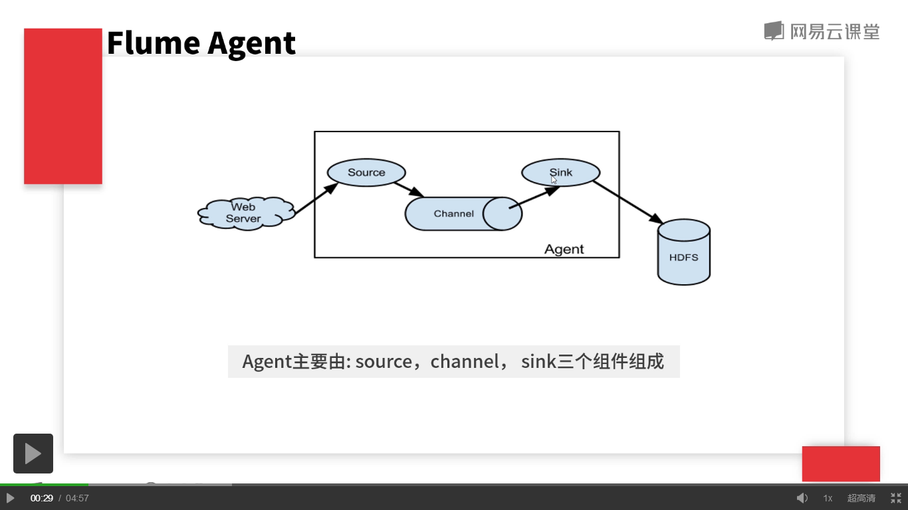

## Flume Agent
  
	
	Agent由source、channel、sink三个组件组成。
		* source：从数据发送端接收数据，并将接受到的数据以Flume的event格式传递给一个或多个通道channel。Flume提供多种数据的接收方式，比如Taildir（服务器上的监听文件），Kafka等。
		* channel是一种短暂的存储容器，它将从source出接收到的event格式的数据缓存起来，知道被sink消费掉。支持类型用：File Channel，Memory Channel等。
		* sink：是持久化组件，将数据保存到极致存储器，它从channel消费数据并将其传递给目标地。目标地：Hive，HDFS，Hbase等。

	Flume Agent工作流程：
		Flume的核心是把数据从数据源（source）收集过来，再将收集的数据送到指定的目的地（sink）。为了保证输送的过程成功，在送到目的地（sink）之前，先将数据  
		缓存（channel），待数据真正到达目的地（sink）后，Flume再删除自己缓存的数据。

	Flume Event
		* Event将传输的数据进行封装，是flume传输数据的基本单位，如果是文本文件，通常是一行记录。
		* Event从source流向channel，再到sink，本身为一个字节数组，可携带header信息。
		* event是事物的基本单位，代表一个数据的最小完整单元。

		FlumeEvent的数据结构：
			class FlumeEvent implements Event,Writable{
				private Map<String,String> headers;
				private byte[] body;
			}
		event 实例：
			{"haeaders":{"mykey":"myvalue"},"body":"real logmsg"}

