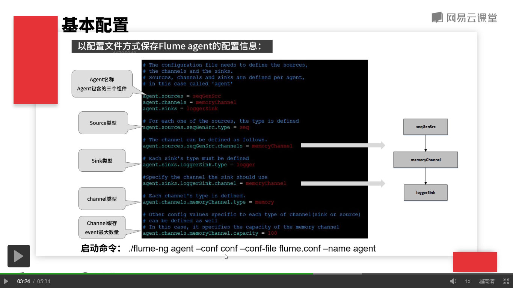

## 基本配置
安装包结构：
	
	* bin 
		* 执行文件目录
		* flume-ng启动程序
	* conf
		* 配置文件目录
		* flume-env.sh
		* flume-conf.properties
		* log4j.properties
	* lib
		* jar包目录
	* logs
		* 日志文件目录
	* docs
		* 帮助文档目录
	* tools
		* 工具包目录

使用本地配置文件保存flume agent的相关信息：

	多个flume agent可以共用同一份配置文件

flume-conf.properties配置文件图：

	每一个flume agent都需要一个名称进行标识，上图名称为 agent。
	启动命令：
		./flume-ng agent --conf conf --conf-file flume.conf --name agent
			* --conf :指定了配置文件的目录，主要包含了flume-env这个配置文件以及日志输出的log4j配置文件。
			* --conf-file:使用什么配置来启动flume agent
			* --name：指定flume agent的名称。
## 基于Zookeeper配置
多个flume agent配置可以使用Zookeeper保存配置文件

	- /flume
		|- /a1 [agent config file] 
		|- /a1 [agent config file] 
	
	$ bin/flume-ng agent --conf conf -z zkhost:2181,zkhost1:2181 -p /flume --name a1

		z: Zookeeper连接地址
		p:Zookeeper中保存agent配置的跟目录
		a1：agent名称

## Flume特性

	* 模块化设计: source/channel/sink 三种组件可以根据业务自由组合，构建相对复杂的日志流管道
	* 可接入性：支持集成多种主流系统和框架，像HDFS、HBase、Hive、Kafka、ES、Thrift、Avro等，都能够很好的和Flume集成。
	* 容错性：event的事物，保证数据在源端和目的端的一致性
	* 可扩展性：可以根据自己业务的需要来定制实现某些组件

			