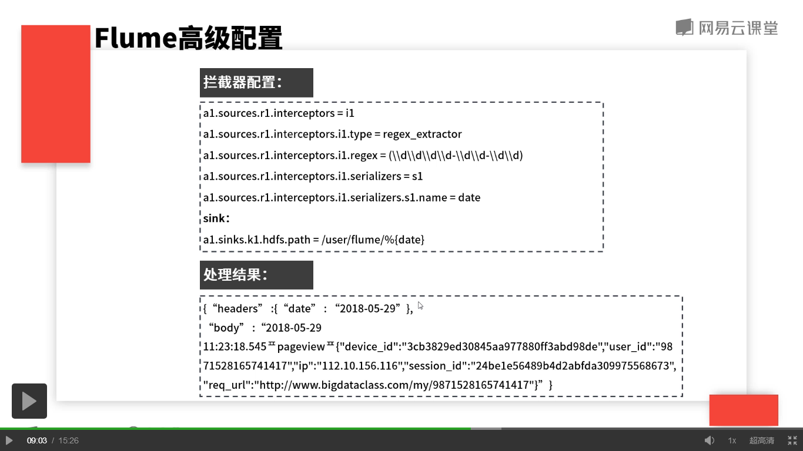

## Flume高级配置
多个flume agent的串联  

	场景：大量客户端生成日志，存储系统出了能力不足的情况  

	场景：客户端生成的日志，根据类型发送到不同的存储服务  

		* 扇出：复制   
		
  

		* 扇出：多路复用   
		

			拦截器：可以在传输过程中修改event数据内容。类型如下：
				- Timestamp Interceptor
				- Host Interceptor
				- Static Interceptor
				- Regex Filtering Interceptor
			
			效果图如下：

			操作：
				1. 进入conf目录，复制flume-conf-taildir2hdfs.properties 
					* cp flume-conf-taildir2hdfs.properties flume-conf-taildir2hdfs-interceptor.properties
				2. 编写flume-conf-taildir2hdfs-interceptor.properties
					* agent.sources = fileSrc
					* agent.channels = memoryChannel
					* agent.sinks = hdfsSink
					
					# For each one of the sources, the type is defined
					* agent.sources.fileSrc.type = taildir
					# 指定文件路径，保存js格式的文件,这个文件记录了每个监听文件的Ilod以及这个文件所在的路径以及上一次的读取位置
					* agent.sources.fileSrc.positionFile = /mnt/home/11705048/workspace/hdfs_sink/interceptor/positionFile
					# 指定了一系列的文件组，这些组通过空格分割，每文件组指向一组被监听的文件
					* agent.sources.fileSrc.filegroups= f1
					# 指定了文件组的绝对路径
					* agent.sources.fileSrc.filegroups.f1= /mnt/hadoop/log/.*.log
					#定义interceptor
					* agent.sources.fileSrc.interceptors = i1
					* agent.sources.fileSrc.interceptors.i1.type = regex_extractor
					* agent.sources.fileSrc.interceptors.i1.regex = (\\d\\d\\d\\d-\\d\\d-\\d\\d)
					* agent.sources.fileSrc.interceptors.i1.serializers =  s1
					* agent.sources.fileSrc.interceptors.i1.serializers.s1.name = date

					# The channel can be defined as follows.
					* agent.sources.fileSrc.filegroups = memoryChannel
					
					# Each sink's type must be defined
					* agent.sinks.hdfsSink.type = hdfs
					# 将数据保存在分布式文件系统的目录
					* agent.sinks.hdfsSink.hdfs.path = /user/11705048/flume_data/interceptor/%{date}
					# DataStream不使用压缩
					* agent.sinks.hdfsSink.hdfs.fileType = DataStream
					# 压缩格式
					# agent.sinks.hdfsSink.hdfs.codeC = gizp/lzo/snappy
					# 写入到hdfs上时怎么分割
					* agent.sinks.hdfsSink.hdfs.rollSize = 0
					* agent.sinks.hdfsSink.hdfs.rollCount = 0
					* agent.sinks.hdfsSink.hdfs.rollInterval = 60
					
					#Specify the channel the sink should use
					* agent.sinks.hdfsSink.channel = memoryChannel
					
					# Each channel's type is defined.
					* agent.channels.memoryChannel.type = memory
					
					# Other config values specific to each type of channel(sink or source)
					# can be defined as well
					# In this case, it specifies the capacity of the memory channel
					* agent.channels.memoryChannel.capacity = 100
				3. 输入启动命令
					* ./bin/flume-ng agent --conf conf --conf-file conf/flume-conf-taildir2hdfs-interceptor.properties --name agent

				4. 验证
					1. hadoop fs -ls /user/11705048/flume_date
					2. hadoop fs -ls /user/11705048/flume_date/interceptor
					3. cd /mnt/hadoop/log
					4. less achive.log