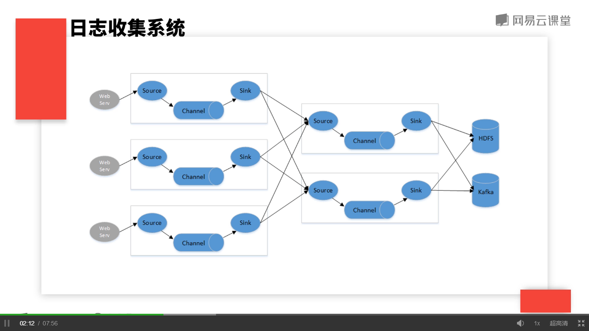

## 日志收集系统

	场景：某电商网站使用日志收集系统，采集服务日志，并分别给hadoop平台提供离线数据和实时计算平台提供实时数据。

	需求：
		- 电商网站包含多个微服务，设计成百上千服务器日志种类多，根据日志类型分流到不同存储服务 
		- 系统可靠性
		- 系统监控

	根据业务需求，得出示意图如下：

  

	系统可靠性：
		- agent宕机
			- agent存活监控
			- 服务日志落盘
		- channel选择
			- memory channel吞吐量大，宕机时丢失数据
			- file channel数据不丢失，吞吐量低
		- 存储服务不可用
			- 利用channel进行数据缓存

	系统监控
		source接收数据量和处理的数据量、channel拥堵的数据量、sink处理数据量

  

	操作：
		1. 进入conf目录，启动flume客户端
			* ./bin/flume-ng agent --conf conf --conf-file conf/flume-conf-taildir2hdfs.properties --name agen -Dflume.monitoring.type=http -Dflume.monitoring.port=34545
		2. 浏览器查看
			* 10.173.32.6:34545

	参考：
[git地址](https://git-wip-us.apache.org/repos/asf/flume.git)  
[安装包地址](http://flume.apache.org/download.html)  
[用户手册](http://flume.apache.org/FlumeUserGuide.html#sizing-a-flume-deployment)  
[开发者手册](http://flume.apache.org/FlumeDeveloperGuide.html#building-flume)  
