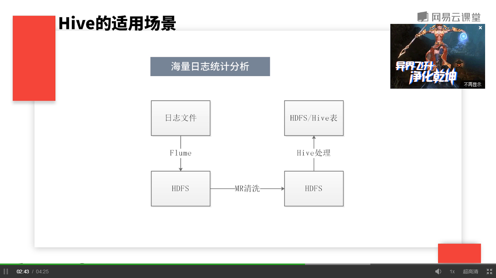
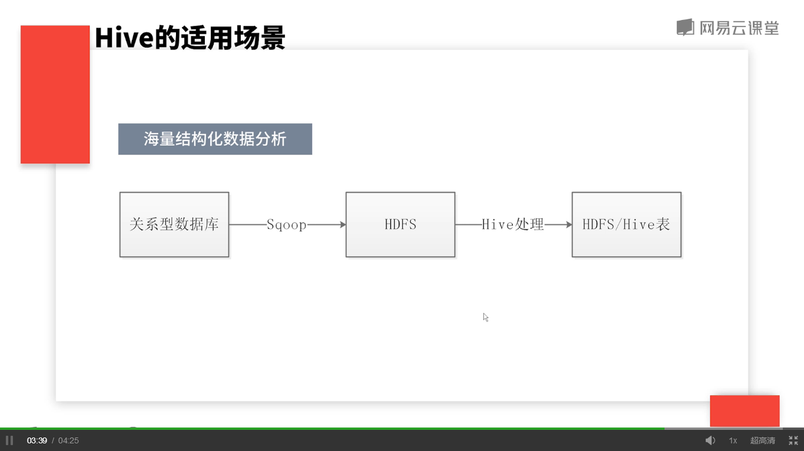

## Hive核心工作

	是把类sql语句翻译成MR程序放到hadoop上执行。

## Hive优势

	* 简单容易上手
	* 开发快速
	* 适合大规模数据的处理

## Hive局限

	* 延迟高
	* 对事物的支持不够好（不能完成delete/update）

Hive擅长非实时的、离线的、对响应及时性要求不高的海量数据批量计算

## 业务场景

	* 海量日志统计分析

	* 海量结构化数据分析

  

## 

