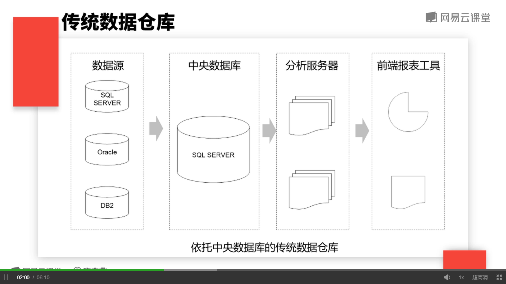
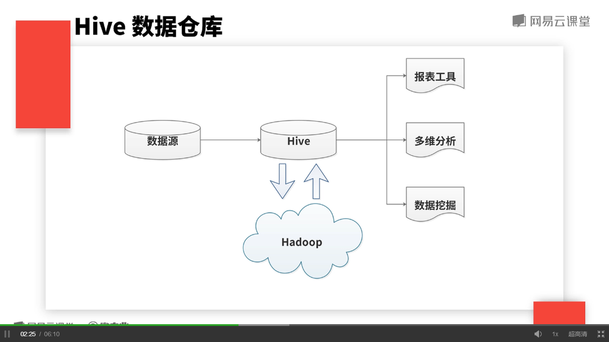
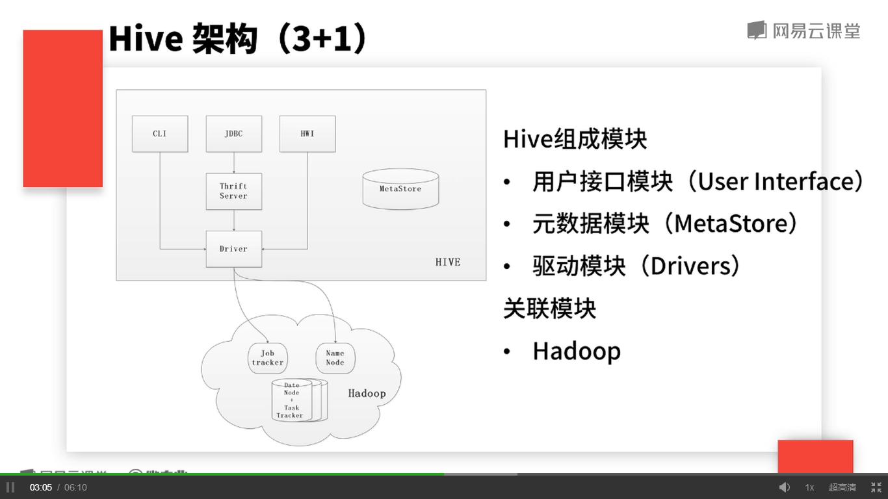
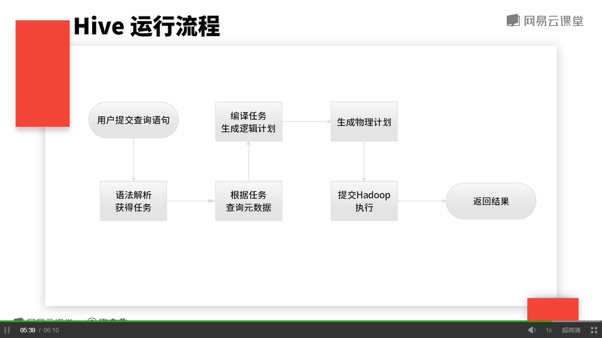

## 数据仓库

	数据仓库是一个
		* 面向主题的（Subject Oriented）
		* 集成的（Integrated）
		* 相对稳定的（Non-Volatile）
		* 反映历史变化的（Time Variant）的数据集合
	用于支持管理决策。

## 传统数据仓库

  

	缺点：无法满足数据量快速增长的需要

## Hive数据仓库

  

## Hive 架构（3+1）

  

	Hive 组成模块
		* 用户接口模块（User Interface）
		* 元数据模块（MetaStore）
		* 驱动模块（Drivers）
	关联模块
		* Hadoop

## Hive运行流程

