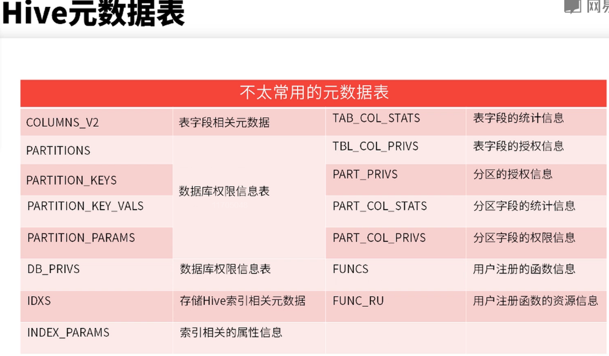

## Hive数据模型

	Hive的数据模型包括：
		* Database 数据库
		* Table    表
		* Partition 分区
		* Bucket   桶

		表：
			- 内部表（适用于中间表，不需要从外部导入数据的情况）
				- Drop时候会删除HDFS上的数据
			- 外部表（适合将外部数据映射到表中的原表）
				- Drop时候不会删除HDFS上的数据

## 元数据

	元数据：描述数据的数据。是具体数据的格式化。

## Hive元数据表

	重要元数据表
		--- | ---  
		存储Hive版本的元数据表 | VERSION   
		Hive数据库相关的元数据表 | DBS、DATABASE_PARAMS  
		Hive表和视图相关的元数据表 | TBLS、TBL_PRIVS、TABLE_PARAMS  
		Hive文件存储信息相关的元数据表 | SDS、SD_PARAMS、SERDES、SERDE_PARAMS  

	不太常用的元数据表

	

			