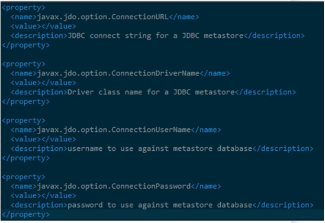
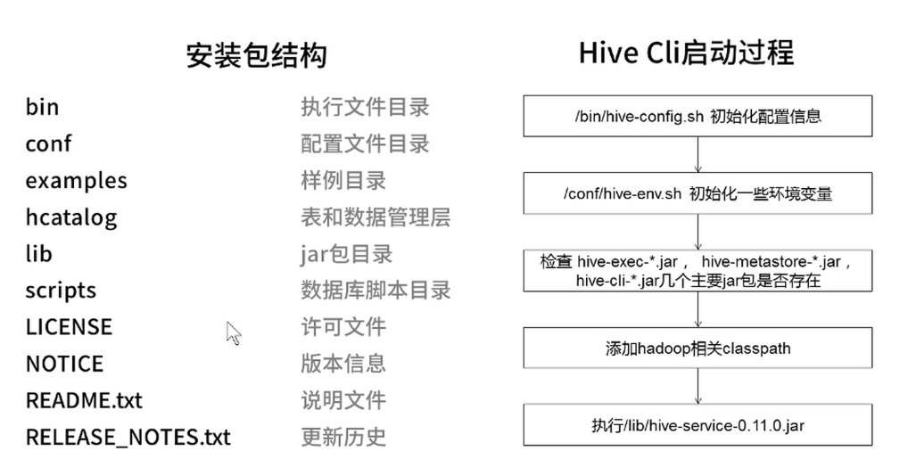

## Hive安装依赖

	依赖条件
		* Hadoop集群
		* 元数据存储
			- 内嵌数据块（Derby）
			- 外部数据库
				* 本地数据库
				* 远程数据库

	三种配置方式的特点与区别
		* 内嵌模式
			- 内嵌的Derby数据库存储元数据异常只能连接一个客户端
		* 本地模式
			- 外部数据库存储元数据metastore服务和hive运行在同一个进程
		* 远程模式
			- 外部数据库存储元数据metastore服务和hive运行在不同进程

	配置文件 hive-site.xml
		通过jdbc URL、驱动、用户名、密码等配置信息，设置不同模式。如下图：

## Hive安装与配置
	* 安装包结构
 
	
	* 安装步骤
		1. 下载hive
			wget https://mirrors.tuna.tsinghua.edu.cn/apache/hive/hive-1.2.2/apache-hive-1.2.2-bin.tar.gz
		2. 解压缩与重命名
			tar -zxvf apache-hive-1.2.2-bin.tar.gz
			mv apache-hive-1.2.2-bin hive
		3. 复制并修改配置文件 hive-env.sh hive-default.xml 和hive-site.xml
			3.1 修改hive-env.sh
				- cp hive-env.sh.template hive-env.sh
				- vim hive-env.sh HADOOP_HOME=/home/hadoop/hadoop-current #hadoop路径
			3.2 把hive-default.xml.template文件复制成hive-default.xml和hive-site.xml，在hive-site.xml中添加
				- <property>
					- <name>system:java.io.tmpdir</name>
					- <value>/home/hadoop/hive</value>
				- </property>
				- <property>
					- <name>system:user.name</name>
					- <value>hadoop</value>
				- </property>

		4. 启动hive
			
				

			