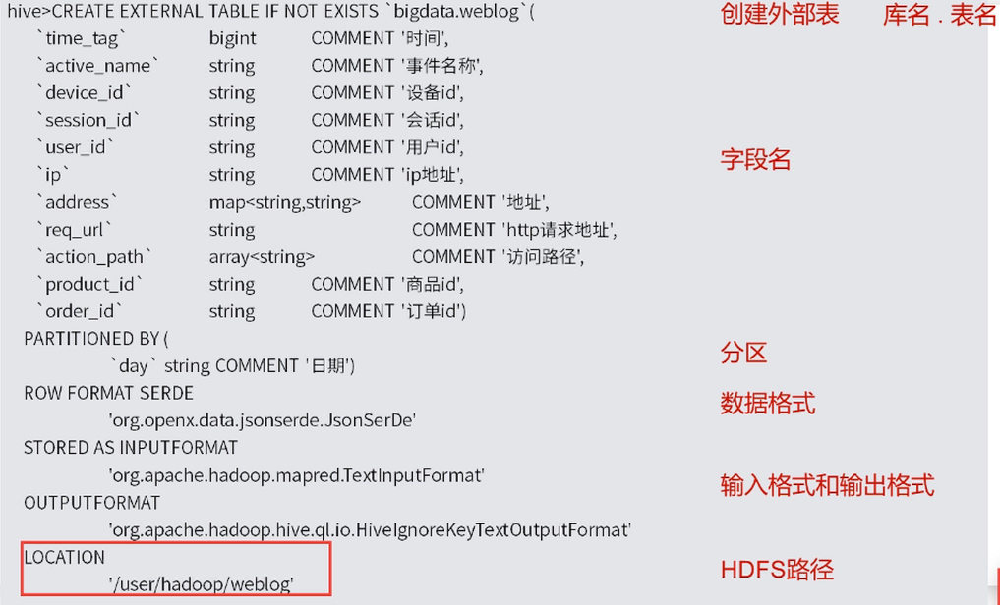

## 创建和管理Hive中的数据库

	创建数据库
		CREATE DATABASE if not exists bigdata;

	删除数据库
		DROP DATABASE if not exists bigdata;

	创建表
		日志数据所在的hdfs路径(数据路径指向它)：
			/user/hadoop/weblog
		json解析包：
			cp /tmp/hivecourse/json-serde-1.3.6-jar-with-dependencies.jar ~/hive/lib
		配置jar包：
			hive-site.xml中添加
				<property>
					<name>hive.aux.jars.path</name>
					<value>file:///mnt/11705048/hive/lib/json-serde-1.3.6-jar-with-dependencies.jar</value>
				</property>

## 创建Hive数据表

  
[建表语句](./060302_建表语句.md)